# Chat App Full Stack Project

This project is a full stack one-to-one chat application with:

- `frontend/`: Vite frontend
- `backend/`: Laravel API backend
- `database/schema.sql`: optional manual MySQL schema

## Feature List

- User registration and login
- One-to-one chat between registered users
- Message history loading per conversation
- Image, file, GIF, and sticker message support
- Contact info and profile panels
- Responsive frontend built for desktop 

## Tech Stack Summary

- Frontend: Vite, JavaScript, HTML, CSS
- Backend: Laravel 10, PHP 8.1+, Sanctum
- Database: MySQL
- Media/GIF: GIPHY API

## API Endpoint Summary

Base API URL:

```text
http://127.0.0.1:8001/api
```

Public endpoints:

- `POST /register` : register a new user
- `POST /login` : log in and receive an auth token

Protected endpoints:

- `POST /logout` : log out the current user
- `GET /me` : fetch the authenticated user
- `GET /users` : fetch the available user list
- `GET /messages/{user}` : fetch conversation messages with a user
- `POST /messages` : send a new message
- `DELETE /messages/{user}` : clear a conversation
- `GET /calls/current` : fetch the current active/ringing call
- `POST /calls` : create a new call session
- `GET /calls/{call}` : fetch a specific call session
- `POST /calls/{call}/offer` : store caller WebRTC offer
- `POST /calls/{call}/answer` : store callee WebRTC answer
- `POST /calls/{call}/candidate` : exchange ICE candidates
- `POST /calls/{call}/decline` : decline an incoming call
- `POST /calls/{call}/end` : end an active call

## Screenshots

The following screenshots are available in the `screenshots/` folder:

### Home Page

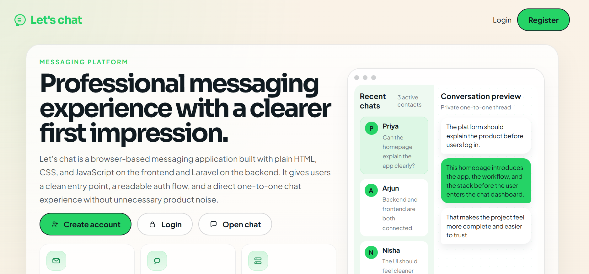
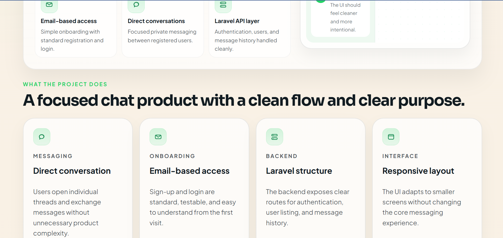
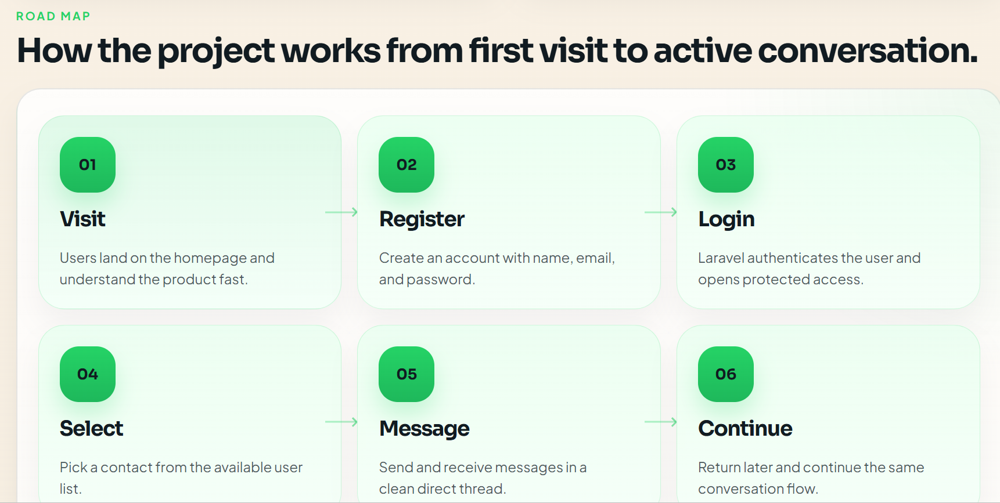
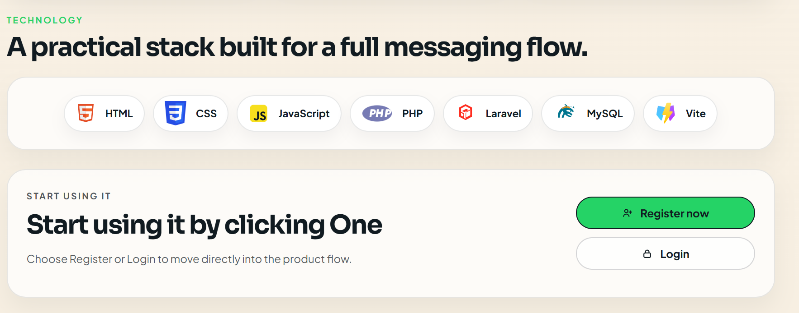

### Authentication

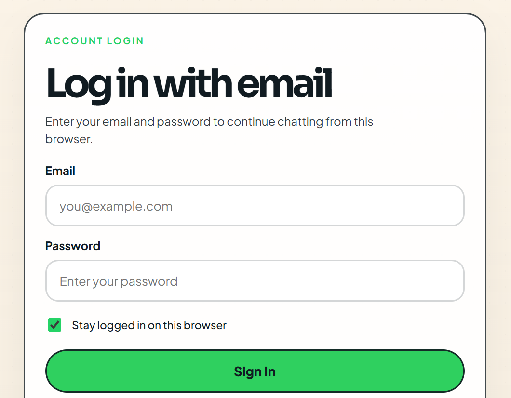
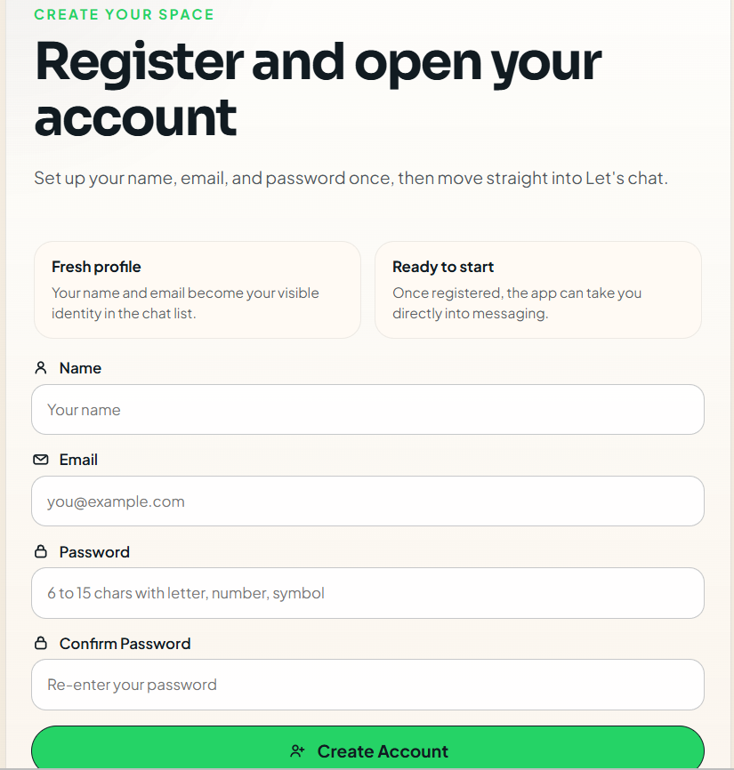

### Loading Screen

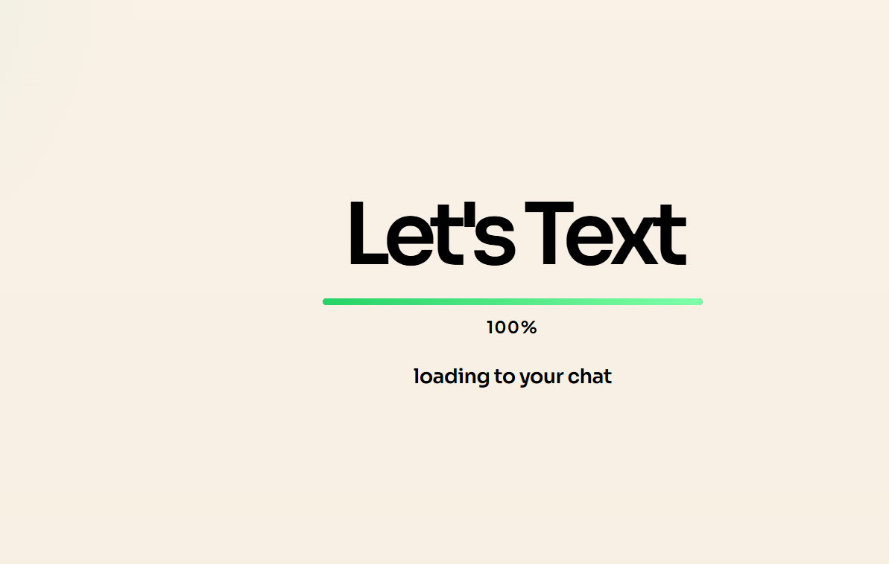

### Chat Pages

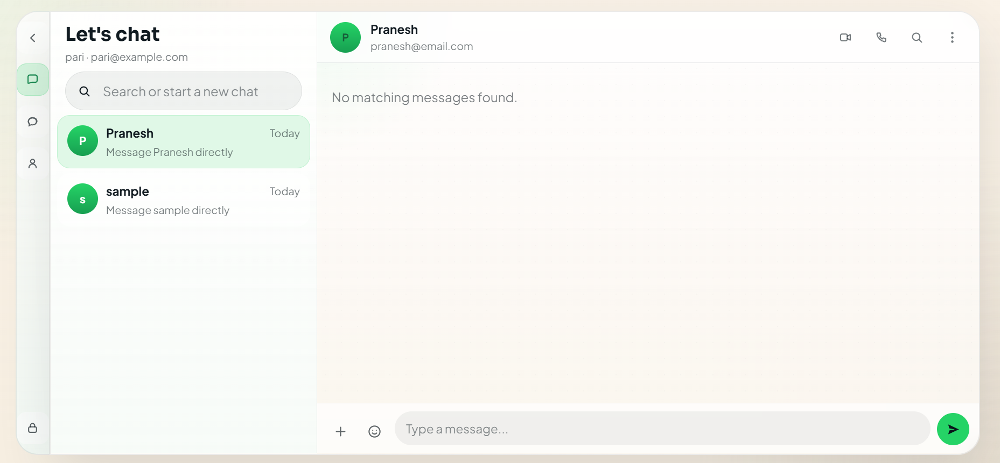
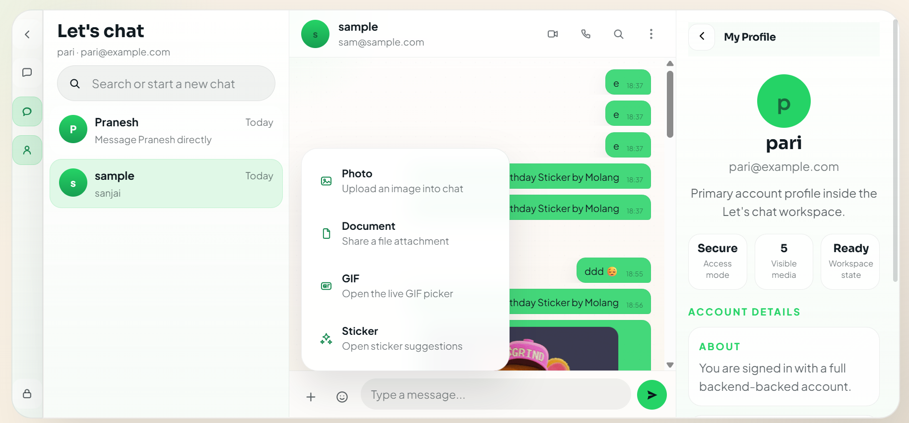
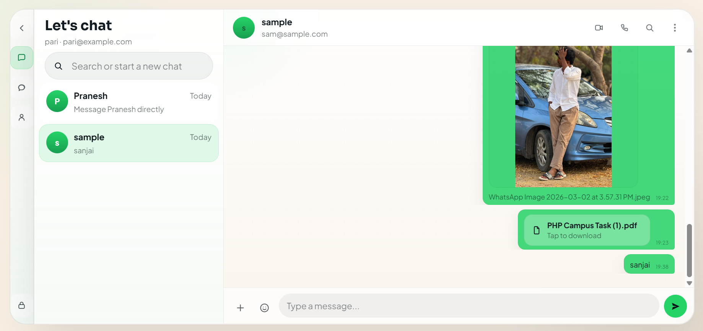
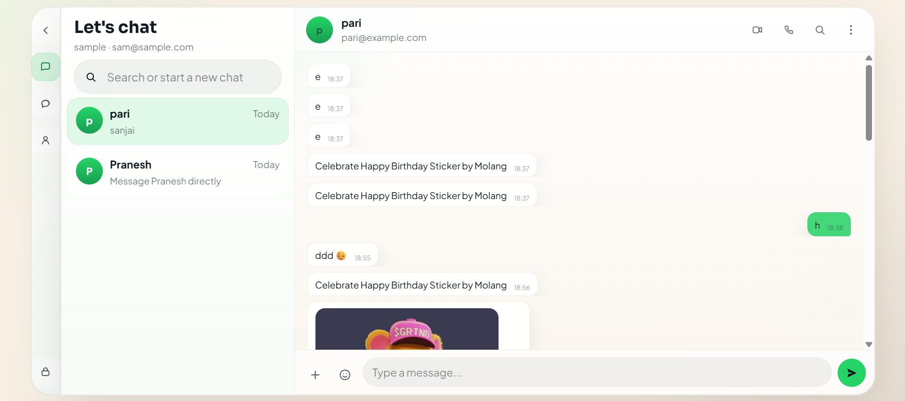

## Requirements

Before running the project locally, make sure you have:

- PHP `8.1+`
- Composer
- Node.js and npm
- MySQL

## Project Structure

```text
chat_app_full/
|- frontend/
|- backend/
`- database/
```

## How To Run Locally

Start the backend first, then the frontend.

### 1. Backend setup

Open a terminal in `backend/` and run:

```bash
composer install
copy .env.example .env
php artisan key:generate
```

After that, update `backend/.env` with your local MySQL database settings.

Run the Laravel migrations:

```bash
php artisan migrate
```

Start the backend server:

```bash
php artisan serve --host=127.0.0.1 --port=8001
```

The backend API will run at:

```text
http://127.0.0.1:8001
```

### 2. Frontend setup

Open a second terminal in `frontend/` and run:

```bash
npm install
copy .env.example .env
```

Update `frontend/.env` so the frontend points to your backend API.

Start the frontend:

```bash
npm run dev
```

The frontend will usually run at:

```text
http://localhost:5173
```

## Database Setup Instructions

The project uses MySQL.

You can set up the database in one of two ways.

### Option 1. Recommended: Laravel migrations

Create a MySQL database, for example:

```sql
CREATE DATABASE chat_app CHARACTER SET utf8mb4 COLLATE utf8mb4_unicode_ci;
```

Then configure `backend/.env` and run:

```bash
php artisan migrate
```

This is the recommended approach because migrations are the main source of truth for the backend schema.

### Option 2. Manual SQL setup

If you prefer manual setup, use:

- `database/schema.sql`

This file creates:

- `users`
- `messages`
- `call_sessions`
- `personal_access_tokens`

After importing `database/schema.sql`, the backend can use the same MySQL database.

## Environment Configuration

### Backend environment

Create:

```text
backend/.env
```

Use `backend/.env.example` as the base.

Important backend values:

```env
APP_NAME=ChatApp
APP_ENV=local
APP_KEY=
APP_DEBUG=true
APP_URL=http://localhost:8000

DB_CONNECTION=mysql
DB_HOST=127.0.0.1
DB_PORT=3306
DB_DATABASE=chat_app
DB_USERNAME=root
DB_PASSWORD=

SANCTUM_STATEFUL_DOMAINS=localhost:5173
```

Notes:

- Set `DB_DATABASE`, `DB_USERNAME`, and `DB_PASSWORD` to your real MySQL values.
- After editing the backend `.env`, if needed run:

```bash
php artisan config:clear
php artisan cache:clear
```

### Frontend environment

Create:

```text
frontend/.env
```

Use `frontend/.env.example` as the base.

Important frontend values:

```env
VITE_API_BASE_URL=http://127.0.0.1:8001/api
VITE_GIPHY_API_KEY=your_giphy_api_key
VITE_WEBRTC_ICE_SERVERS=[{"urls":["stun:stun.l.google.com:19302","stun:stun1.l.google.com:19302"]},{"urls":"turn:your-turn-host:3478","username":"your_turn_username","credential":"your_turn_password"}]
```

Notes:

- `VITE_API_BASE_URL` must match the Laravel backend URL.
- `VITE_GIPHY_API_KEY` is needed for live GIF/sticker search.
- `VITE_WEBRTC_ICE_SERVERS` supports STUN/TURN configuration for voice/video calling.

## Recommended Local Run Order

1. Create the MySQL database.
2. Configure `backend/.env`.
3. Run backend migrations.
4. Start Laravel on port `8001`.
5. Configure `frontend/.env`.
6. Start Vite.

## Quick Start Commands

Backend:

```bash
cd backend
composer install
copy .env.example .env
php artisan key:generate
php artisan migrate
php artisan serve --host=127.0.0.1 --port=8001
php artisan config:clear; php artisan cache:clear; php artisan migrate:fresh
php -S 127.0.0.1:8001 -t public public/index.php
```

Frontend:

```bash
cd frontend
npm install
copy .env.example .env
npm run dev
```

## Troubleshooting

### Backend cannot connect to the database

Check:

- MySQL is running
- `backend/.env` database values are correct
- the `chat_app` database exists

### Frontend cannot reach the backend

Check:

- Laravel is running on `127.0.0.1:8001`
- `frontend/.env` has the correct `VITE_API_BASE_URL`

### GIFs or calls are not working correctly

Check:

- `VITE_GIPHY_API_KEY` is set for GIF search
- `VITE_WEBRTC_ICE_SERVERS` is configured correctly for STUN/TURN

## Summary

To run the project locally:

- install backend dependencies
- configure backend `.env`
- create and migrate the MySQL database
- install frontend dependencies
- configure frontend `.env`
- run backend and frontend servers in separate terminals
