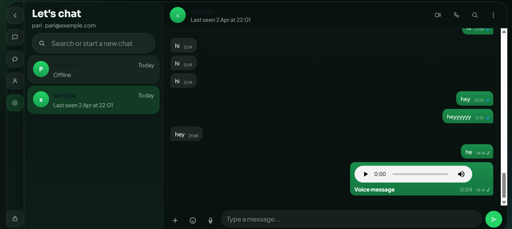

# Chat App Full Stack Project

## Overview

This repository contains a full-stack one-to-one chat application built with a Vite frontend and a Laravel API backend.

The app is designed to provide a WhatsApp-like direct messaging experience with:

- registration and login
- private one-to-one conversations
- message history per contact
- message status ticks
- online presence and last seen
- dark mode
- image, file, GIF, sticker, and voice messages
- voice and video calling with WebRTC signaling
- responsive chat layout for desktop and mobile

The codebase is split into two major parts:

- `frontend/` for the browser app
- `backend/` for the Laravel API and database logic

There is also:

- `database/` for SQL/schema assets
- `screenshots/` for UI images
- `docs/` for any additional project material present in the repo

## Screenshots

### Home Page


### Authentication


### Loading State


### Main Chat UI




## What This Project Does

At a high level, the application allows registered users to:

- create accounts
- log in securely using Laravel Sanctum tokens
- see a list of other available users
- open a private conversation with a selected user
- send and receive text and media messages
- view old chat history
- clear a conversation
- see online presence and last seen
- see delivery and read tick states
- record and send voice messages
- start voice and video calls
- switch the full UI between light mode and dark mode

The frontend is a custom vanilla JavaScript single-page app using Vite for development and build tooling.

The backend is a Laravel API with:

- authentication
- user presence
- chat persistence
- call session signaling
- validation
- MySQL persistence

## Repository Structure

```text
chat_app_full/
|-- backend/
|-- database/
|-- docs/
|-- frontend/
|-- screenshots/
|-- docker-compose.yml
|-- README.md
|-- TESTING_CHECKLIST.md
`-- WHATSAPP_FEATURES.md
```

## Tech Stack

### Frontend

- Vite
- JavaScript
- HTML
- CSS

### Backend

- PHP 8.1+
- Laravel 10
- Laravel Sanctum

### Database

- MySQL

### Realtime / Communication Style

- HTTP polling for chat updates and presence
- WebRTC for voice and video media connections
- Laravel API endpoints for call signaling

### External Services

- GIPHY API for live GIF and sticker search
- STUN/TURN configuration for WebRTC

## Current Feature Set

### Authentication

- user registration
- user login
- token-based protected API access
- logout
- restore authenticated session from local storage

### Chat

- private one-to-one chat
- optimistic sending for text/media messages
- cached conversation switching
- old message history loading
- clear current conversation
- thread search within the current chat
- sidebar search for contacts

### Message Types

- text
- GIF
- sticker
- image
- file
- audio / voice

### Presence and Status

- online badge
- last seen timestamps
- delivery ticks
- read ticks

### UI / UX

- dark mode
- responsive layout
- sticky chat header
- sticky composer
- loading state
- banner error feedback

### Calling

- voice call
- video call
- basic WebRTC peer signaling flow through Laravel endpoints

## Important Current Behavior

The application is near-real-time, but it is not a WebSocket app.

The app currently uses polling for:

- message refresh
- users list refresh
- delivery updates
- heartbeat/presence
- call state polling

That means the app is designed to feel fast, but it is still HTTP polling, not socket-based realtime transport.

## Important Current Media Behavior

Media messages can originate as inline data URLs from the frontend for:

- recorded voice messages
- attached files
- attached images

The backend now normalizes inline media into real files under:

```text
backend/public/chat-media/
```

and conversation responses return normal URLs such as:

```text
http://127.0.0.1:8001/chat-media/message-28.webm
```

This reduces very heavy conversation payloads and improves old-message loading compared with storing giant inline blobs directly in every history response.

## Project Architecture

### Frontend Architecture

The frontend is organized into small JavaScript modules under:

```text
frontend/src/modules/
```

Key modules:

- `app.js` handles top-level route rendering and page transitions
- `auth.js` handles login and registration events
- `chat.js` contains most chat runtime logic, polling, rendering coordination, sending, and call behavior
- `api.js` wraps frontend API requests
- `router.js` handles SPA route changes
- `state.js` holds shared app state
- `views.js` renders the page templates and chat markup
- `dom.js` manages mounting and root selection
- `events.js` binds general navigation events
- `status.js` supports message tick/presence behavior
- `voice.js` exists for voice-related logic support
- `utils.js` provides shared helpers

### Backend Architecture

The Laravel backend is centered around these controllers:

- `AuthController.php`
- `UserController.php`
- `ChatController.php`
- `CallController.php`

Responsibilities:

- `AuthController` handles register, login, logout, and authenticated user fetch
- `UserController` handles user listing and presence heartbeat
- `ChatController` handles message history, sending, clearing, delivered/read updates, and media normalization
- `CallController` handles call session creation and signaling state

## API Summary

Base API URL:

```text
http://127.0.0.1:8001/api
```

### Public Endpoints

- `POST /register`
- `POST /login`

### Protected Endpoints

- `POST /logout`
- `GET /me`
- `GET /users`
- `POST /presence/heartbeat`
- `GET /messages/{user}`
- `POST /messages`
- `POST /send-message`
- `POST /messages/delivered`
- `POST /messages/{user}/read`
- `DELETE /messages/{user}`
- `GET /calls/current`
- `POST /calls`
- `GET /calls/{call}`
- `POST /calls/{call}/offer`
- `POST /calls/{call}/answer`
- `POST /calls/{call}/candidate`
- `POST /calls/{call}/decline`
- `POST /calls/{call}/end`

## Backend Route Reference

The backend route file is:

```text
backend/routes/api.php
```

Route grouping is protected with:

```php
Route::middleware('auth:sanctum')->group(function () {
    // protected routes
});
```

## Database Model Overview

### Core Tables

- `users`
- `messages`
- `call_sessions`
- `personal_access_tokens`

### Users Table

The users table is used for:

- identity
- authentication
- presence state

Important fields used by the app:

- `id`
- `name`
- `email`
- `password`
- `is_online`
- `last_seen_at`
- `created_at`
- `updated_at`

### Messages Table

The messages table stores conversation history.

Important fields used by the app:

- `id`
- `sender_id`
- `receiver_id`
- `type`
- `content`
- `media_url`
- `duration_seconds`
- `delivered_at`
- `read_at`
- `created_at`
- `updated_at`

### Call Sessions Table

The call sessions table stores signaling state for active/ringing calls.

The exact schema depends on the project migrations or imported SQL, but it supports:

- caller/callee IDs
- call type
- offer/answer SDP
- ICE candidates
- call status and lifecycle timestamps

## Authentication Flow

### Registration

1. User submits name, email, password, and password confirmation.
2. Laravel validates the request.
3. A new user record is created.
4. A Sanctum token is created.
5. The frontend stores the token and user in local storage.
6. The user is sent into the chat flow.

### Login

1. User submits email and password.
2. Laravel validates credentials.
3. Old tokens are revoked for that user.
4. A fresh token is issued.
5. Presence is touched.
6. The frontend stores the token and user.
7. The app loads users and then the selected conversation.

### Logout

1. The frontend ends active runtime loops.
2. The frontend calls `POST /logout`.
3. Laravel deletes the current access token.
4. Local auth state is cleared.
5. The user is routed back to `/login`.

## Chat Flow

### Basic Direct Messaging Flow

1. User logs in.
2. Frontend loads available users.
3. Frontend selects a default user if none is selected.
4. Frontend fetches `GET /messages/{user}`.
5. Messages are rendered in ascending creation order.
6. When the user sends a message, the UI first inserts an optimistic message.
7. The app posts to `POST /messages`.
8. The optimistic message is replaced with the confirmed backend message.
9. Background refresh keeps the thread updated.

### Message Privacy

Conversation queries are restricted to the two participants only.

The backend groups the message query as:

- authenticated user -> selected user
- selected user -> authenticated user

This prevents unrelated users from seeing conversation rows they are not part of.

## Supported Message Types

### Text

- sent through the composer
- optimistic rendering
- stored as standard message content

### GIF

- selectable from the picker
- can come from GIPHY live results
- displayed inline in chat

### Sticker

- selectable from the picker
- displayed inline in chat

### Image

- attached via file input
- previewable in thread
- downloadable from thread

### File

- attached via file input
- shown as a file card
- downloadable from thread

### Voice / Audio

- recorded from the browser microphone
- duration stored in `duration_seconds`
- rendered with an audio player

## Message Status Logic

The UI supports three primary states for sent messages:

- single tick for sent
- double tick for delivered
- blue double tick for read

The backend status fields currently used are:

- `delivered_at`
- `read_at`

Behavior:

- if a message exists and neither delivered nor read timestamps are set, it is treated as sent
- when the receiver app marks pending inbound messages as delivered, `delivered_at` is set
- when a conversation is opened and marked read, both `delivered_at` and `read_at` are set

## Presence Logic

Presence is currently heartbeat-based.

### How It Works

- frontend sends `POST /presence/heartbeat`
- backend updates `is_online` and `last_seen_at`
- user list endpoint computes whether a user counts as online based on a recent cutoff

Current backend behavior:

- users are considered online if `is_online` is true
- `last_seen_at` must exist
- `last_seen_at` must be within the configured cutoff window

## Voice Messages

### Frontend Behavior

- browser microphone permission is requested
- recording starts through `MediaRecorder`
- duration label updates while recording
- audio is converted for upload
- optimistic audio message is inserted into the thread

### Backend Behavior

- uploaded audio can be stored via `media_url`
- media data URLs are normalized to a file in `backend/public/chat-media`
- final API responses return a file URL instead of a giant inline audio blob

## Calls

The app includes call support for:

- voice
- video

The call flow uses:

- Laravel API endpoints for signaling
- `RTCPeerConnection` in the browser
- configurable STUN/TURN servers from frontend environment variables

### Call Endpoints

- create call session
- fetch current call
- post offer
- post answer
- exchange ICE candidates
- decline call
- end call

### Call Caveat

This implementation is signaling-based and browser/WebRTC dependent. Real-world call stability still depends on:

- browser support
- microphone/camera permissions
- STUN/TURN correctness
- network conditions

## Dark Mode

The frontend includes a rail toggle that switches the entire application theme.

Dark mode behavior:

- applies to the chat UI globally
- persists in local storage
- changes the rail icon between moon and sun

## Performance Work Already Applied

The current codebase includes several improvements specifically targeted at responsiveness:

- safer frontend mounting
- reduced unnecessary full rerenders
- stable recording timer updates without remounting the chat
- cached chat switching
- lighter background refresh rules
- persistent conversation cache in local storage
- media normalization so old message history is not overloaded by huge inline blobs
- improved empty/loading states during conversation load

## Known Limitations

This is an honest list of important current limits.

### No True WebSocket Realtime

The app uses polling, not sockets.

That means:

- it can feel fast
- it is not true push realtime
- it will generate periodic HTTP requests

### Media Storage Is Basic

Media files are stored under:

```text
backend/public/chat-media/
```

This is acceptable for local/dev use, but production would usually want:

- storage abstraction
- cloud object storage
- cleanup rules
- file validation hardening

### Frontend Is Vanilla JS

This is intentional, but it means:

- large state flows are managed manually
- rerender coordination must be handled carefully
- scaling the UI further may benefit from a component framework later

### Presence Is Approximate

Heartbeat presence is not true socket presence.

So:

- online state is approximate
- last seen depends on heartbeat timing and page activity

## Requirements

Before running locally, make sure you have:

- PHP 8.1 or newer
- Composer
- Node.js
- npm
- MySQL

Recommended:

- a modern Chromium-based browser for media and calling tests
- two browser sessions for multi-user testing

## Local Development Setup

## 1. Clone or open the project

Place the repository in a local workspace, for example:

```text
d:\xampp\htdocs\chat_app_full
```

## 2. Backend setup

Open a terminal in `backend/` and run:

```bash
composer install
copy .env.example .env
php artisan key:generate
```

Then configure `backend/.env` for your MySQL database.

Typical important values:

```env
APP_NAME=ChatApp
APP_ENV=local
APP_KEY=
APP_DEBUG=true
APP_URL=http://127.0.0.1:8001

DB_CONNECTION=mysql
DB_HOST=127.0.0.1
DB_PORT=3306
DB_DATABASE=chat_app
DB_USERNAME=root
DB_PASSWORD=
```

Run migrations:

```bash
php artisan migrate
```

If your schema is stale or config is cached, run:

```bash
php artisan config:clear
php artisan cache:clear
php artisan migrate
```

Start Laravel:

```bash
php artisan serve --host=127.0.0.1 --port=8001
```

Backend API base will be:

```text
http://127.0.0.1:8001/api
```

## 3. Frontend setup

Open a second terminal in `frontend/` and run:

```bash
npm install
copy .env.example .env
```

Edit `frontend/.env` as needed.

Current important values:

```env
VITE_API_BASE_URL=http://127.0.0.1:8001/api
VITE_GIPHY_API_KEY=your_giphy_api_key
VITE_WEBRTC_ICE_SERVERS=[{"urls":["stun:stun.l.google.com:19302","stun:stun1.l.google.com:19302"]}]
```

Start Vite:

```bash
npm run dev
```

Frontend will usually be available at:

```text
http://localhost:5173
```

## 4. Build the frontend

To produce a production build:

```bash
cd frontend
npm run build
```

## 5. Optional preview

```bash
cd frontend
npm run preview
```

## Quick Start

### Backend

```bash
cd backend
composer install
copy .env.example .env
php artisan key:generate
php artisan migrate
php artisan serve --host=127.0.0.1 --port=8001
```

### Frontend

```bash
cd frontend
npm install
copy .env.example .env
npm run dev
```

## Database Setup Options

You can initialize the database in two main ways.

### Option A: Laravel migrations

Recommended.

Example database creation:

```sql
CREATE DATABASE chat_app CHARACTER SET utf8mb4 COLLATE utf8mb4_unicode_ci;
```

Then run:

```bash
php artisan migrate
```

### Option B: Manual SQL

The repo includes:

```text
database/schema.sql
```

This can be used to create a compatible starting schema manually.

If you use manual SQL first and later update the app, you should still run Laravel migrations so newer columns exist.

## Seeder Notes

The default Laravel seeder in:

```text
backend/database/seeders/DatabaseSeeder.php
```

creates demo users such as:

- `alice@example.com`
- `bob@example.com`
- `charlie@example.com`
- `diana@example.com`

with a default password:

```text
password123
```

This is useful for local testing only.

## Docker

The repository includes:

```text
docker-compose.yml
```

If you want to use Docker, inspect and adapt that file to your local environment and ports.

This README focuses mainly on the direct local PHP + Vite workflow because that matches the current project usage most closely.

## Frontend Environment Variables

File:

```text
frontend/.env
```

Supported important variables:

- `VITE_API_BASE_URL`
- `VITE_GIPHY_API_KEY`
- `VITE_WEBRTC_ICE_SERVERS`

### `VITE_API_BASE_URL`

Points the frontend to the Laravel API.

Example:

```env
VITE_API_BASE_URL=http://127.0.0.1:8001/api
```

### `VITE_GIPHY_API_KEY`

Enables live remote GIF and sticker search.

If not provided, the app still works, but live GIPHY search is limited and may show fallback behavior.

### `VITE_WEBRTC_ICE_SERVERS`

JSON array for STUN/TURN configuration.

Example:

```env
VITE_WEBRTC_ICE_SERVERS=[{"urls":["stun:stun.l.google.com:19302","stun:stun1.l.google.com:19302"]}]
```

## Backend Environment Variables

File:

```text
backend/.env
```

Important settings:

- `APP_URL`
- `DB_CONNECTION`
- `DB_HOST`
- `DB_PORT`
- `DB_DATABASE`
- `DB_USERNAME`
- `DB_PASSWORD`
- `SANCTUM_STATEFUL_DOMAINS`

### Sanctum note

This app primarily uses bearer tokens from the frontend. Keep backend/frontend origins aligned sensibly during local development.

## Route and Page Summary

### Frontend Routes

- `/`
- `/login`
- `/register`
- `/chat`

### Backend API Routes

Public:

- register
- login

Protected:

- me
- logout
- users
- messages
- presence
- calls

## Screenshot Index

The following image assets are currently present in the repo:

- `screenshots/homepage1.png`
- `screenshots/homepage2.png`
- `screenshots/homepage3.png`
- `screenshots/homepage4.png`
- `screenshots/loginpage.png`
- `screenshots/registerpage.png`
- `screenshots/loadingpage.png`
- `screenshots/chatpage.png`
- `screenshots/chat_options_page.png`
- `screenshots/sender_page.png`
- `screenshots/reciever_page.png`
- `screenshots/darkmode.png`

## Detailed Run Flow

### First Run Checklist

1. Create the MySQL database.
2. Configure `backend/.env`.
3. Run backend dependencies.
4. Run migrations.
5. Start Laravel on port `8001`.
6. Configure `frontend/.env`.
7. Install frontend dependencies.
8. Start Vite.
9. Open the frontend in a browser.
10. Register or log in with test users.

### Recommended Testing Setup

To test chat properly:

1. Open one browser window as User A.
2. Open another browser window or incognito session as User B.
3. Keep both on the chat screen.
4. Test text, media, and presence behavior between them.

## Testing Scenarios

### Authentication

- register a new account
- log out
- log back in
- refresh the page
- confirm session restoration works

### Text messaging

- send text from user A to user B
- confirm optimistic render on sender
- confirm appearance on receiver
- refresh and confirm history remains

### Message privacy

- create users A, B, C
- send A to B
- confirm C cannot access A/B conversation content

### Presence

- keep one user open
- close another tab
- confirm last seen updates after heartbeat window

### Voice messages

- allow microphone access
- record a short message
- send it
- confirm playback works on the other user

### File/image messages

- send an image
- open/download it
- send a file
- download it

### GIF / sticker messages

- open picker
- select GIF or sticker
- confirm render in thread

### Dark mode

- toggle dark mode in the rail
- refresh page
- confirm theme persists

### Clear chat

- open a conversation
- clear the conversation
- confirm thread empties

### Call tests

- start a voice call
- test accept/decline
- test video call if permissions exist

## Troubleshooting

## Problem: Backend cannot connect to database

Check:

- MySQL is running
- database exists
- `backend/.env` values are correct
- Laravel config cache is cleared if values changed

Useful commands:

```bash
cd backend
php artisan config:clear
php artisan cache:clear
```

## Problem: Frontend cannot reach backend

Check:

- Laravel is running on `127.0.0.1:8001`
- `frontend/.env` points to the correct API base URL
- browser console/network tab shows the exact failing URL

## Problem: `401 Unauthorized`

Likely causes:

- token missing
- token expired or invalid
- user opened `/chat` without valid login state
- backend token storage out of sync

Fix:

- log out
- log back in
- confirm `POST /login` returns `token`

## Problem: `404 Not Found`

Likely causes:

- wrong API base URL
- wrong asset path
- missing route
- missing screenshot/media/public file

Check the exact failing URL in DevTools Network.

## Problem: old messages seem missing

Check:

- the backend has conversation rows in MySQL
- the frontend is using the correct logged-in user
- browser has loaded the latest built/dev code
- hard refresh after major frontend changes

The current code uses conversation caching and improved thread loading to reduce empty transient states.

## Problem: UI feels slow

Possible causes:

- backend not running cleanly
- very heavy old media payloads before normalization
- browser tab using stale frontend code
- multiple dev servers or unstable localhost networking

Current improvements already in place:

- reduced full rerenders
- media URL normalization
- conversation caching
- lighter polling rules

## Problem: GIF or sticker search is empty

Check:

- `VITE_GIPHY_API_KEY` is set
- browser network can reach GIPHY

## Problem: voice/video calling does not work

Check:

- browser permission for microphone/camera
- HTTPS or compatible local browser media rules
- STUN/TURN settings if testing across more difficult networks

## Problem: media files do not load

Check:

- Laravel server is serving `backend/public`
- generated files exist under `backend/public/chat-media`
- returned `media_url` points to the correct backend base URL

## Security Notes

This project is suitable for local development and learning, but production hardening would still need more work.

Areas to review before real production deployment:

- stricter file validation
- storage abstraction
- media cleanup strategy
- rate limiting review
- CORS review
- HTTPS everywhere
- better auth/session lifecycle handling
- stronger error logging/monitoring
- background job strategy for large media
- true realtime transport if scale matters

## Performance Notes

The app has already had several practical optimizations applied:

- reduced chat rerender churn
- avoided full thread rerender during recording timer updates
- cached conversation state per user
- persisted conversation cache in local storage
- suppressed unnecessary background polling work
- normalized heavy media into files

The next major architectural upgrade, if you want a more production-grade messaging feel, would be:

- WebSockets or SSE for realtime delivery

instead of relying on polling.

## Files Worth Reading First

If you are new to the codebase, these are the best entry points:

### Frontend

- `frontend/src/main.js`
- `frontend/src/modules/app.js`
- `frontend/src/modules/chat.js`
- `frontend/src/modules/views.js`
- `frontend/src/modules/api.js`
- `frontend/src/styles/app.css`

### Backend

- `backend/routes/api.php`
- `backend/app/Http/Controllers/AuthController.php`
- `backend/app/Http/Controllers/UserController.php`
- `backend/app/Http/Controllers/ChatController.php`
- `backend/app/Http/Controllers/CallController.php`

## Extra Repo Documents

This repo also includes:

- `TESTING_CHECKLIST.md`
- `WHATSAPP_FEATURES.md`

These files can be useful for:

- manual QA scenarios
- feature overview
- understanding expected chat behaviors

## Suggested Improvement Roadmap

If this project is extended further, the highest-value next steps would likely be:

1. replace message polling with WebSockets or SSE
2. move media storage to Laravel storage disks or cloud object storage
3. add pagination or incremental conversation loading for very large histories
4. add proper background workers for heavy media processing
5. add automated backend and frontend tests
6. add stronger production auth/session handling
7. add conversation ordering from backend by actual latest message timestamp
8. improve call reliability and TURN support
9. add typing indicators
10. add group chat if the scope expands beyond one-to-one

## Commands Reference

### Backend install

```bash
cd backend
composer install
```

### Backend env setup

```bash
copy .env.example .env
php artisan key:generate
```

### Backend migration

```bash
php artisan migrate
```

### Backend cache clear

```bash
php artisan config:clear
php artisan cache:clear
```

### Backend serve

```bash
php artisan serve --host=127.0.0.1 --port=8001
```

### Frontend install

```bash
cd frontend
npm install
```

### Frontend env setup

```bash
copy .env.example .env
```

### Frontend dev

```bash
npm run dev
```

### Frontend build

```bash
npm run build
```

### Frontend preview

```bash
npm run preview
```

## FAQ

### Is this a single-page app?

Yes. The frontend behaves as a lightweight SPA with manual route handling.

### Is this using React or Vue?

No. The current frontend is vanilla JavaScript with modular rendering.

### Is this true realtime chat?

Not fully. It is polling-based, not WebSocket-based.

### Does it support old message history?

Yes. Message history is loaded per conversation from MySQL.

### Does it support dark mode?

Yes.

### Does it support media messages?

Yes. Text, GIF, sticker, image, file, and audio/voice are supported.

### Does it support calls?

Yes, voice and video calling are included through WebRTC signaling endpoints.

### Is it mobile responsive?

Yes. The app includes responsive layout work for mobile and smaller screens.

### Where are screenshots stored?

In the `screenshots/` folder.

### Can I use SQLite instead of MySQL?

The app is currently documented and structured around MySQL. Adapting it to SQLite would require checking migrations, schema expectations, and performance behavior carefully.

## Final Summary

This project is a practical full-stack chat application with:

- a custom Vite frontend
- a Laravel 10 backend
- Sanctum authentication
- MySQL persistence
- direct one-to-one messaging
- media messages
- presence
- status ticks
- dark mode
- responsive chat UI
- WebRTC-based calls

It is well suited for:

- learning full-stack chat flows
- prototyping messaging features
- studying frontend/backend coordination
- experimenting with chat UX in a non-framework frontend

If you are running this locally for the first time, the shortest path is:

1. configure MySQL in `backend/.env`
2. run `php artisan migrate`
3. start Laravel on port `8001`
4. configure `frontend/.env`
5. run `npm install`
6. run `npm run dev`
7. open the app and test with two users

## License

No explicit license file is currently included in this repository.

If you plan to publish or distribute the project, add a license file appropriate for your intended usage.
